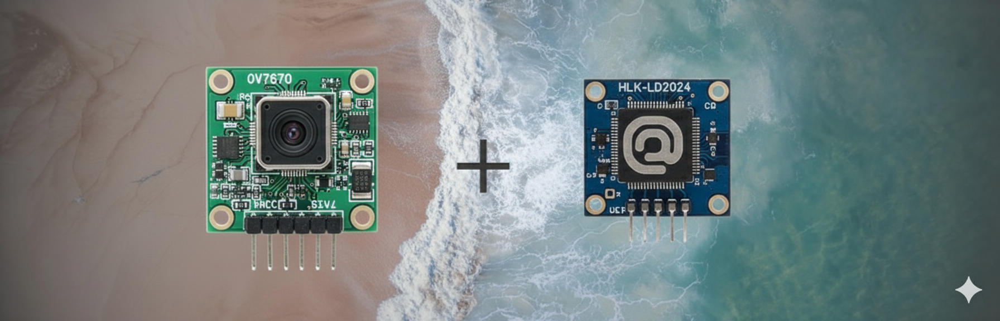
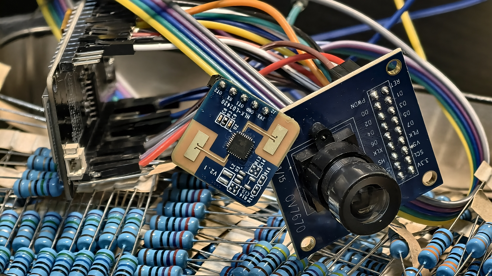
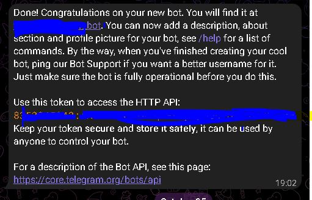
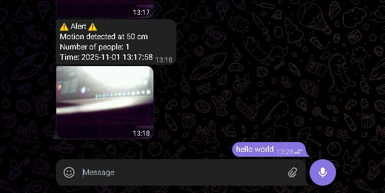
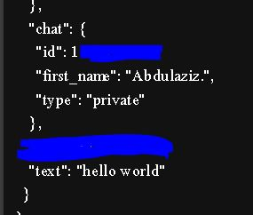
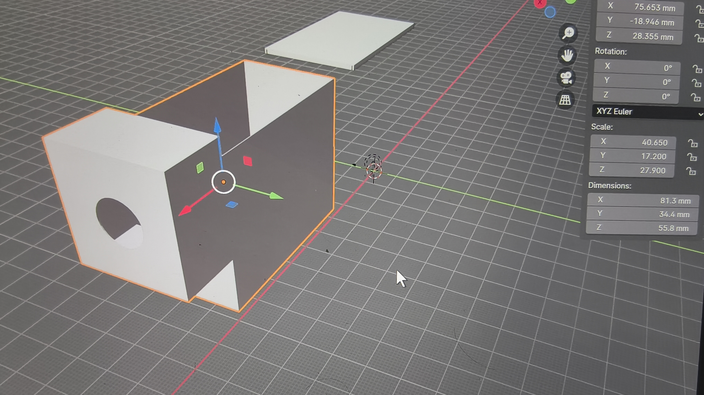
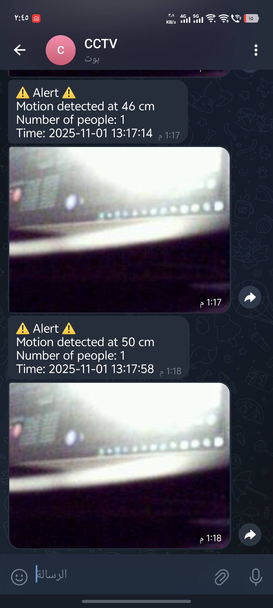

# Cam-Alert-CCTv++

🚨 SEND ALERT TO TELEGRAM BOT 🚨

  
I used an ESP32 with an OV7670 camera and an LD2420 radar motion sensor.
The LD2420 detects human presence, breathing, and heartbeats using millimeter-wave technology.
It can count people and measure their distance precisely.
The OV7670 camera captures real-time images to support visual monitoring.
All collected data and images are sent automatically to a Telegram bot for remote alerts

  

## Setup Telegram Bot

1. To create a new bot, go to **@BotFather** on Telegram and send the command `/newbot`.
   
2. After you choose a name for your bot, select a username it must end with `_bot`
   
3. Now you have your token it is very important for the code to connect to Telegram.
   
4. You can revoke your token anytime by sending `/revoke` to @BotFather and you will immediately receive a new token.
   
5. To get your Chat ID, send a message to your bot, then open your browser and go to `https://api.telegram.org/bot****YOUR_BOT_TOKEN****/getUpdates` and you will get your Chat ID from the JSON response.
   
   

## setup Esp32

[main](main/main.ino)

- Don’t forget to set up your Wi-Fi connection before running the code
    
  `const char* ssid = "****************************";`  
  `const char* password = "****************************";`

- And make sure your Telegram connection is properly configured.
    
  `const char* BOT_TOKEN = "*********************************";`  
  `const char* CHAT_ID = "***********************************";`
    

- You need to wire the pins according to the Pin Configuration (ESP32 + OV7670 + LD2420) table.

| Component           | Function                | ESP32 Pin | Description / Notes                        |
| ------------------- | ----------------------- | --------- | ------------------------------------------ |
| **Camera (OV7670)** | VCC                     | 3.3V      | Power supply for camera (use 3.3V only ⚠️) |
|                     | GND                     | GND       | Common ground with ESP32                   |
|                     | PWDN                    | -1        | Power down (not used)                      |
|                     | RESET                   | 18        | Camera reset pin                           |
|                     | XCLK                    | 32        | External clock for camera                  |
|                     | VSYNC                   | 34        | Frame sync                                 |
|                     | HREF                    | 35        | Horizontal reference                       |
|                     | PCLK                    | 33        | Pixel clock                                |
|                     | D0                      | 19        | Data bit 0                                 |
|                     | D1                      | 23        | Data bit 1                                 |
|                     | D2                      | 13        | Data bit 2                                 |
|                     | D3                      | 12        | Data bit 3                                 |
|                     | D4                      | 14        | Data bit 4                                 |
|                     | D5                      | 27        | Data bit 5                                 |
|                     | D6                      | 26        | Data bit 6                                 |
|                     | D7                      | 25        | Data bit 7                                 |
|                     | SDA                     | 21        | I2C data line                              |
|                     | SCL                     | 22        | I2C clock line                             |
| **LD2420 Sensor**   | VCC                     | 3.3V      | Power supply for LD2420 (⚠️ 3.3V only)     |
|                     | GND                     | GND       | Common ground with ESP32                   |
|                     | RX (to LD2420 TX / OT1) | 16        | Serial RX2 (ESP receives data)             |
|                     | TX (to LD2420 RX)       | 17        | Serial TX2 (ESP sends commands)            |

---

💡 **Notes:**

- Both the **OV7670** and **LD2420** must be powered from the **3.3V pin** of the ESP32 — _never use 5V!_
- Always connect **all GND pins together** (ESP32, OV7670, LD2420) to ensure a stable signal reference.
- Check wiring carefully before uploading code to avoid damaging components.

- In the LD2420 sensor, you can set the detection limit using MAX_DETECTION_CM in [main](main/main.ino) Example:`const int MAX_DETECTION_CM = 700;` The sensor supports a maximum range of up to 8 meters

- This code starts the web server on port 80 and sends the ESP32’s IP address to the Telegram bot so you can access the live camera stream directly from the link
  `Serial.println("Open the browser at: http://" + WiFi.localIP().toString());`
  

  

## 3D print case

You can design or 3D print a custom case to hold the **ESP32**, **OV7670 camera**, and **LD2420 sensor**.  
Make sure to leave openings for the **camera lens**, **power cable**, and **ventilation**.  
Use lightweight materials such as **PETG** for the best results.  
In my design, I used **Blender** for modeling and editing the case.

form the [3DFile](3DFile) folder the project includes two files:

> [Box](3DFile/camBox.stl)   > [Box cover](3DFile/camBoxcover.stl)
> 
> 

  

  
  
[@vuvvvv](https://github.com/vuvvvv)

<!-- 🔹 Meta SEO -->
<meta charset="UTF-8">
<meta name="viewport" content="width=device-width, initial-scale=1.0">
<meta name="description" content="Smart ESP32 CCTVTelegramBOT with LD2420 motion sensor and OV7670 camera, sending instant alerts to Telegram.">
<meta name="keywords" content="🚨   SEND ALERT TO TELEGRAM BOT   🚨">
<meta name="author" content="Cam-Alert-CCTv">
<meta name="robots" content="index, follow">

<!-- 🔹 Open Graph (Facebook, WhatsApp, LinkedIn) -->
<meta property="og:title" content="Smart ESP32 CCTVTelegramBOT with LD2420 motion sensor and OV7670 camera, sending instant alerts to Telegram.">
<meta property="og:description" content="🚨   SEND ALERT TO TELEGRAM BOT   🚨">
<meta property="og:image" content="img/1.png">
<meta property="og:url" content="https://github.com/vuvvvv/Cam-Alert-CCTv">
<meta property="og:type" content="website">
<meta property="og:site_name" content="Cam-Alert-CCTv">

<!-- 🔹 Twitter Cards -->
<meta name="twitter:card" content="summary_large_image">
<meta name="twitter:title" content="Smart ESP32 CCTVTelegramBOT with LD2420 motion sensor and OV7670 camera, sending instant alerts to Telegram.">
<meta name="twitter:description" content="🚨   SEND ALERT TO TELEGRAM BOT   🚨">
<meta name="twitter:image" content="img/1.png">

<!-- 🔹 Favicon & Theme -->
<link rel="icon" type="image/png" sizes="32x32" href="img/1.png">
<link rel="icon" type="image/png" sizes="16x16" href="img/1.png">
<meta name="theme-color" content="#0d0d0d">
